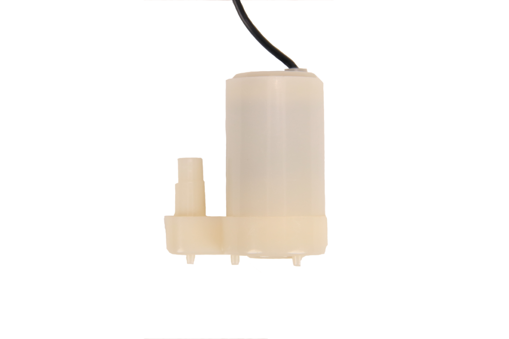
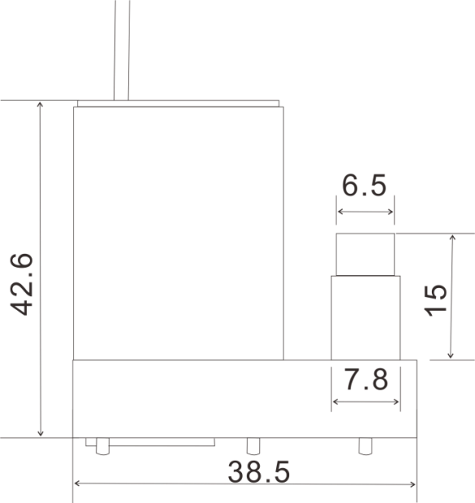
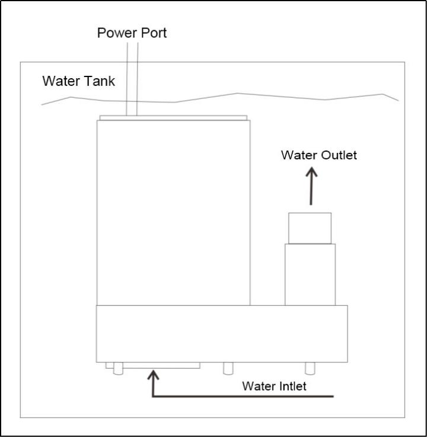
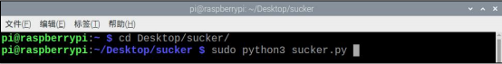

# 1. Water Pump

## 1.1 Product Introduction

Hiwonder water pump module needs to be put into water when in use and can work after supplied by DC 2.5V-6V power. In our daily life, we can use the water pump coordinating with soil sensor to make an intelligent watering system.

## 1.2 Specification Instruction

### 1.2.1 Specification

| Working Voltage |    DC 2.5V-6V     |
| :-------------: | :---------------: |
| Working Current | 0.18A（DC 4.5V）  |
|      Power      | 0.91W（DC 4.5V）  |
| Hydraulic head  | 0.55m（DC 4.5V）  |
|    Flow Rate    | 100L/H（DC 4.5V） |

### 1.2.2 Dimension Drawings

Unit: mm

## 1.3 Operation Method

## 1.4 Project process 

Step 1: Connect water pump module to M1 port on expansion board.

Step 2: Turn on robot and connect to Raspberry Pi desktop with VNC. Then, transfer the folder "**sucker**" to the desktop.

Step 3: Click  or press "**Ctrl+Alt+T**" to enter the LX terminal.

Step 4: Enter "**cd Desktop/sucker/**" command, and then press "**Enter**" to come to the category of games programmings.

Step 5: Enter "**sudo python3 sucker.py**", then press "**Enter**" to execute program. The pump starts pumping for 5 seconds and then stops.

Step 6: If you want to exit the game programming, press "**Ctrl+C**" in the LX terminal interface. If the exit fails, please try it few more times.

## 1.5 Q&A

Q1：How should i distinguish positive and negative poles of water pump when in use ?

A: When supply water pump power, connect positive pole to one of ports freely and negative pole to the other port. Then,water pump can work.

Q2：What should you pay attention to when water pump is working?

A: Instructions:

This is a DC water pump so that the voltage must be DC power supply such as battery, power supply marked with DC, and transformer. Please note that water pump can only be used within specified voltage range. Do not use it under over-voltage condition!

①　Do not use water pump without water for a long time.

②　Do not use water pump in acidic and alkaline solutions.

③　Do not use water pump in liquids with impurities and magnetic particles larger than 0.35mm. If water is too dirty, please clean up impurities in the pump room timely .

Q3: Can the water pump module be directly connected to the Raspberry Pi controller?

A: No. The water pump module must be used with motor drive module.